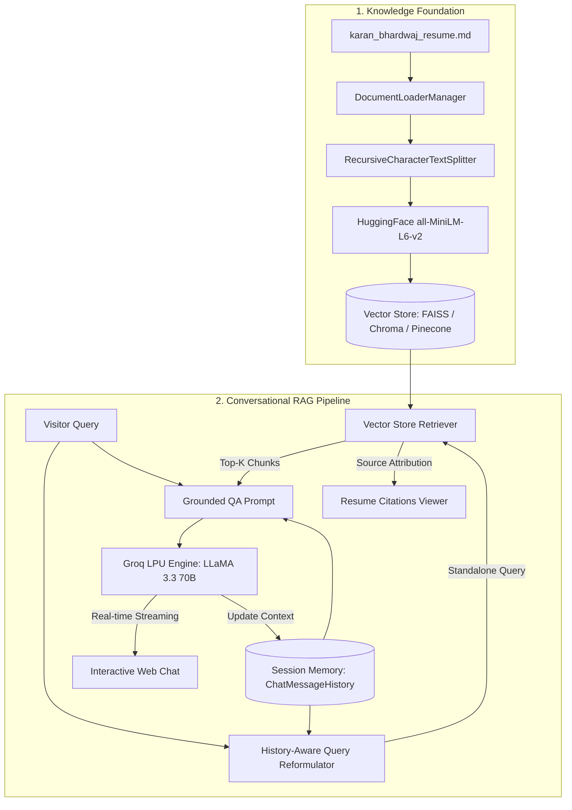

# ⚡ Conversational AI & Resume RAG Portal
### Engineered by **Karan Bhardwaj** — *Full Stack & AI Systems Specialist*

[](https://karanbhardwaj.in)
[](https://linkedin.com/in/karan-bhardwaj)
[](https://github.com/karanongit)
[](mailto:karanbhardwaj1107@gmail.com)

---

## 👨‍💻 About Karan Bhardwaj

**Full Stack Engineer** with a deep specialization in architecting scalable, automation-driven web applications and AI-powered systems. Expert in combining **Generative AI**, **LangChain**, **Groq LPU API**, **FastAPI**, **Next.js**, and **Multi-VectorStore Architectures** to solve real-world problems.

- **Location**: Sahibzada Ajit Singh Nagar, Punjab, India
- **Portfolio**: [karanbhardwaj.in](https://karanbhardwaj.in)
- **Education**: B.Tech in Computer Software Engineering, Galgotias University

---

## 🌟 Project Overview

This application is a production-grade, modular **Conversational Retrieval-Augmented Generation (RAG)** platform. It uses **Karan Bhardwaj's Official Resume & Engineering Knowledge Base** as its pre-indexed foundation, allowing any visitor to interact, query, and learn about Karan's work experience, engineering accomplishments, AI projects (such as *FHMNews.com* and *Socioglamm*), and technical skill sets in real-time.

### ⚡ Key Capabilities:
1. **Ultra-Fast Groq Inference**: Powered by `ChatGroq` (`llama-3.3-70b-versatile`, `mixtral-8x7b-32768`, etc.) with sub-second streaming responses.
2. **Multi-Turn Conversation Memory**: Maintains dialogue context and reformulates follow-up queries using LangChain LCEL.
3. **Pluggable Vector Stores**: Seamlessly switches between **FAISS** (in-memory/local), **ChromaDB** (local persistent), and **Pinecone** (cloud managed).
4. **Auto-Loaded Knowledge Base**: Visitors immediately experience an interactive AI persona grounded in Karan Bhardwaj's verified resume data.
5. **Interactive Citations**: Every generated answer provides transparent document chunks and source citations.

---

## 📊 Benchmark Comparison: ExplainGitHub vs. Karan RAG Engine

| Parameter / Dimension | explaingithub.com | karanrag.streamlit.app | Difference / Advantage |
| :--- | :---: | :---: | :--- |
| **1. Conceptual & Pipeline Synthesis** | `4.0 / 10` | **`9.5 / 10`** | **+5.5 (Custom App)** — Synthesizes whole workflows vs literal term failures. |
| **2. Abstract Reasoning & Nuance** | `5.0 / 10` | **`9.0 / 10`** | **+4.0 (Custom App)** — Evaluates qualitative questions with deep architecture context. |
| **3. Source Citation & Transparency** | `6.5 / 10` | **`9.0 / 10`** | **+2.5 (Custom App)** — Explicit, chunk-level numbered citations vs generic tabs. |
| **4. Input Ingestion & Flexibility** | `3.0 / 10` | **`9.5 / 10`** | **+6.5 (Custom App)** — Multi-source support (PDFs, DOCX, Scraping) vs repo limits. |
| **5. Zero-Prompt / Instant UI UX** | **`9.0 / 10`** | `6.5 / 10` | **+2.5 (ExplainGitHub)** — Pre-baked dashboard tabs ready on load without prompting. |
| **6. Code Mapping & Execution Depth** | `7.0 / 10` | **`8.5 / 10`** | **+1.5 (Custom App)** — Maps concepts directly to scripts and implementation code. |
| **🏆 Overall Score** | **`34.5 / 60`** | **`52.0 / 60`** | **⭐ Winner: karanrag.streamlit.app (+17.5 pts)** |

👉 *For the comprehensive analysis, see [COMPARISON.md](COMPARISON.md).*

---

## 🏗️ Architecture Flow



---

## 🚀 Getting Started

### 1. Clone & Setup Environment

```bash
git clone git@github.com:karanOnGit/LangChainBasic.git
cd LangChainBasic

# Create and activate virtual environment
python3.11 -m venv .venv
source .venv/bin/activate

# Install dependencies
pip install -r requirements.txt
```

### 2. Configure API Key

Copy `.env.example` to `.env` and insert your free Groq API key from [console.groq.com](https://console.groq.com):

```bash
cp .env.example .env
```

```env
GROQ_API_KEY=gsk_your_groq_api_key_here
GROQ_MODEL=llama-3.3-70b-versatile
DEFAULT_VECTOR_STORE=faiss
```

---

## 🖥️ Running the Application

### Option 1: Streamlit Web Dashboard
```bash
streamlit run app.py
```
Open `http://localhost:8501`. Karan's resume is automatically pre-indexed and ready for interactive questions.

### Option 2: Terminal CLI
```bash
python cli.py
```

---

## 📁 Repository Structure

```
.
├── app.py                            # Streamlit Web App (Karan Bhardwaj AI Portal)
├── cli.py                            # Interactive Terminal CLI
├── requirements.txt                  # Python dependencies
├── .env.example                      # Environment variables template
├── sample_data/
│   └── karan_bhardwaj_resume.md      # Karan Bhardwaj Official Resume Knowledge Base
├── src/
│   ├── config.py                     # App configuration & model parameters
│   ├── loaders.py                    # Multi-format document loader
│   ├── splitters.py                  # Recursive text chunking
│   ├── embeddings.py                 # Local HuggingFace embeddings
│   ├── vectorstores.py               # FAISS, Chroma, Pinecone manager
│   ├── memory.py                     # Conversation state & history manager
│   └── rag_chain.py                  # LCEL Conversational RAG Engine
└── tests/
    └── test_rag.py                   # Automated test suite
```

---

## 📬 Connect with Karan Bhardwaj

- **Website**: [karanbhardwaj.in](https://karanbhardwaj.in)
- **LinkedIn**: [linkedin.com/in/karan-bhardwaj](https://linkedin.com/in/karan-bhardwaj)
- **GitHub**: [github.com/karanongit](https://github.com/karanongit)
- **Email**: [karanbhardwaj1107@gmail.com](mailto:karanbhardwaj1107@gmail.com)

---

<p align="center">Made with Love 🤍 by <strong>Karan Bhardwaj</strong></p>
