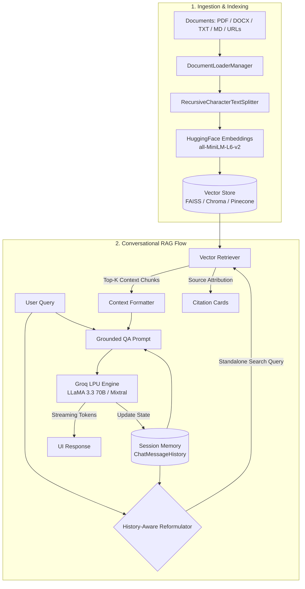

# ⚡ Conversational RAG with LangChain, Groq & Multi-VectorStore

A modern, production-grade **Conversational Retrieval-Augmented Generation (RAG)** application powered by **LangChain (LCEL)** and the ultra-low-latency **Groq API** (`ChatGroq`).

Features full **conversation memory & state management**, **multi-format document loading and splitting**, and **pluggable vector store backends** (**FAISS**, **ChromaDB**, and **Pinecone**).

---

## 🌟 Key Features

1. **⚡ Ultra-Fast Groq Inference**:
   - Integrated with `ChatGroq` supporting `llama-3.3-70b-versatile`, `llama-3.1-8b-instant`, `mixtral-8x7b-32768`, and `gemma2-9b-it`.
   - Real-time token streaming for instantaneous response rendering.

2. **🧠 Multi-Turn Conversation Memory**:
   - Built on LangChain's `RunnableWithMessageHistory` and session-based `InMemoryChatMessageHistory`.
   - **History-Aware Contextual Query Reformulation**: automatically reformulates follow-up queries into standalone search queries based on prior dialogue turns before performing vector retrieval.

3. **📂 Flexible Document Ingestion & Chunking**:
   - Supports **PDF**, **Microsoft Word (DOCX/DOC)**, **Markdown**, **TXT**, and **Web URLs** (`WebBaseLoader`).
   - Intelligent `RecursiveCharacterTextSplitter` with customizable chunk sizes, overlaps, and chunk metadata indexing.

4. **🔌 Pluggable Vector Stores**:
   - **FAISS**: In-memory and local disk index for instant search with zero configuration.
   - **ChromaDB**: Embedded persistent vector database with collection management.
   - **Pinecone**: Cloud serverless vector database index for large-scale production indexing.

5. **🔍 Transparent Grounding & Source Citations**:
   - Every answer includes expandable citations containing the source filename/URL, page numbers, and exact chunk content snippets.

6. **💻 Dual User Interfaces**:
   - **Interactive Web App**: Modern **Streamlit** dashboard with drag-and-drop document upload, live ingestion statistics, vector store switcher, and streaming chat.
   - **Terminal CLI**: Rich, color-coded interactive command-line interface with streaming output.

---

## 🏗️ Architecture Diagram



---

## 🚀 Quick Start Guide

### 1. Prerequisites
- Python 3.11 or higher
- A Groq API key (Get one for free at [console.groq.com](https://console.groq.com))

### 2. Environment Setup

```bash
# Clone the repository and enter directory
cd /Users/cv/Documents/LangChain

# Create and activate virtual environment
python3.11 -m venv .venv
source .venv/bin/activate

# Install dependencies
pip install -r requirements.txt
```

### 3. Configure API Keys

Copy `.env.example` to `.env` and add your Groq API key:
```bash
cp .env.example .env
```

Edit `.env`:
```env
GROQ_API_KEY=gsk_your_groq_api_key_here
GROQ_MODEL=llama-3.3-70b-versatile
DEFAULT_VECTOR_STORE=faiss
```

*(Optional: If using Pinecone, also add `PINECONE_API_KEY` and `PINECONE_INDEX_NAME`)*

---

## 🖥️ Running the Application

### Option A: Interactive Streamlit Web Interface (Recommended)

Launch the web app:
```bash
streamlit run app.py
```
Open your browser at `http://localhost:8501`.

**How to use:**
1. Enter your Groq API Key in the sidebar (or let it read from `.env`).
2. Upload documents via drag-and-drop or click **"Load Sample Dataset"**.
3. Click **"🚀 Index & Build Vector Store"**.
4. Ask questions in the chat! Notice how follow-up questions retain context and source cards show retrieved references.

---

### Option B: Terminal CLI

Run the interactive CLI with a document or URL:
```bash
# Chat with a local file
python cli.py -f sample_data/knowledge_base.md --store faiss --model llama-3.3-70b-versatile

# Chat with a web article
python cli.py -u https://en.wikipedia.org/wiki/Large_language_model --store chroma
```

**CLI Commands inside session:**
- `/clear`: Clear conversation memory.
- `/stats`: View active memory count.
- `/exit` or `q`: Exit the application.

---

## 🧪 Running Automated Tests

Run the test suite with `pytest`:
```bash
pytest -v
```

---

## 📁 Project Structure

```
.
├── app.py                     # Streamlit Interactive Web Application
├── cli.py                     # Command-line Interface with streaming
├── requirements.txt           # Project dependencies
├── .env.example               # Environment variables template
├── pytest.ini                 # Pytest configuration
├── sample_data/               # Test documents (Markdown, TXT)
│   ├── knowledge_base.md
│   └── company_policy.txt
├── src/                       # Core Modular Architecture
│   ├── __init__.py
│   ├── config.py              # Configuration & Model constants
│   ├── loaders.py             # Multi-format document loader
│   ├── splitters.py           # Text splitter with metadata enrichment
│   ├── embeddings.py          # HuggingFace & local embeddings
│   ├── vectorstores.py        # VectorStoreManager (FAISS, Chroma, Pinecone)
│   ├── memory.py              # Session-based memory & state manager
│   └── rag_chain.py           # LCEL History-Aware Conversational RAG Pipeline
└── tests/
    └── test_rag.py            # Automated test suite
```

---

## 🧩 Python Code Usage Example

You can also use the RAG pipeline directly in your own Python scripts:

```python
from src.loaders import DocumentLoaderManager
from src.splitters import TextSplitterManager
from src.embeddings import get_embedding_model
from src.vectorstores import VectorStoreManager
from src.memory import MemoryManager
from src.rag_chain import ConversationalRAGChain

# 1. Load and split documents
docs = DocumentLoaderManager.load_from_file("sample_data/knowledge_base.md")
chunks = TextSplitterManager(chunk_size=1000, chunk_overlap=200).split_documents(docs)

# 2. Build Vector Store (FAISS / Chroma)
embeddings = get_embedding_model("sentence-transformers/all-MiniLM-L6-v2")
vector_store = VectorStoreManager.create_vector_store("faiss", chunks, embeddings)
retriever = VectorStoreManager.get_retriever(vector_store, k=4)

# 3. Create Conversational RAG Chain
rag = ConversationalRAGChain(
    retriever=retriever,
    groq_api_key="your_groq_api_key",
    model_name="llama-3.3-70b-versatile",
)

# 4. Turn 1: Initial Question
response1 = rag.query("What are the key capabilities of AI agents?", session_id="user1")
print("Answer 1:", response1["answer"])

# 5. Turn 2: Follow-up question (Memory automatically reformulates query!)
response2 = rag.query("Which memory systems do they use?", session_id="user1")
print("Answer 2:", response2["answer"])
```

---

## 🛡️ License & Acknowledgements
Built with [LangChain](https://www.langchain.com/) and [Groq](https://groq.com/).
